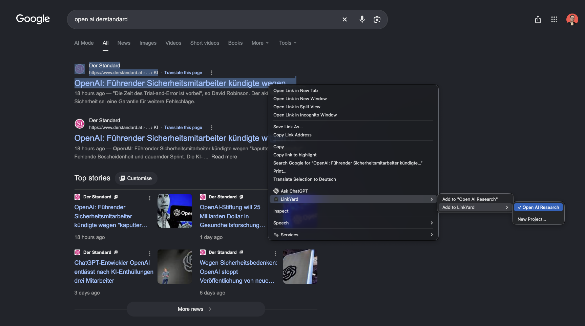
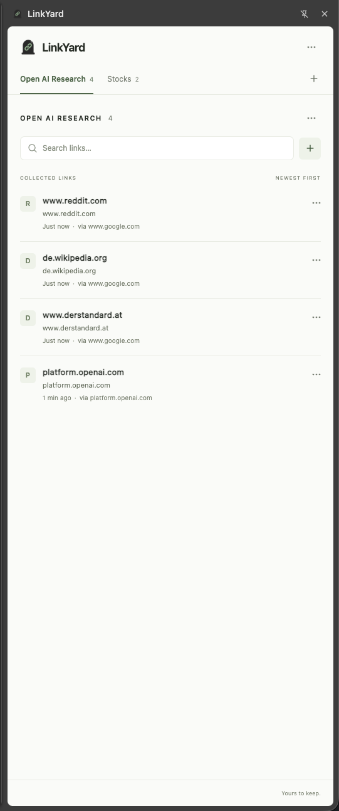

# LinkYard


LinkYard is a project-based link collector for your browser. Right-click, collect, keep moving.

Collect without breaking your browsing flow. Keep research in projects, browse alongside a compact Chrome side panel, and export your links whenever you need them.

## Features

- Project tabs with persistent selection and horizontal scrolling
- Chrome context menu: quick collection into the current project or any other project
- Create a project from the context menu and save the selected link in one step
- Side panel opened from the toolbar icon
- Local-first storage, without accounts or a backend
- Search titles, URLs, domains and source metadata within the active project
- Duplicate detection, including URL fragments and trailing slashes
- Open, copy, move and delete links
- Create, rename and delete projects
- Project JSON and TXT exports, plus full workspace export
- Keyboard controls, accessible menus and native dialogs

## Install

Requires Chrome 116 or later. No build step or dependency installation is needed.

1. Open `chrome://extensions`.
2. Enable **Developer mode**.
3. Click **Load unpacked**.
4. Select this LinkYard project directory, containing `manifest.json`.
5. Pin LinkYard in Chrome's extensions menu and click its icon to open the side panel.

After changing extension files, click **Reload** on its card in `chrome://extensions`, then reopen the panel.

## Usage

Create a project → browse the web → right-click a link → add it to LinkYard.

### Collect links with a right-click

The quick context-menu entry shows `Add to "Your project"`. The **Add to LinkYard** submenu lets you pick another project; this does not switch your active project. **New Project…** opens the side panel, asks for a name and collects the selected link in that new project. Chrome may group multiple extension menu entries inside one LinkYard parent menu.



### Manage links in the side panel

Switch projects with the tabs. Use the `+` next to them to create a project, or the `+` next to search to add an HTTP/HTTPS URL manually. Project names are trimmed and limited to 100 characters.

Links appear newest first. The link's menu offers **Open in new tab**, **Copy URL**, **Move to project…** and **Delete link**. A URL already present in the destination project cannot be moved there. Deleting a project asks for confirmation and removes all its links.

Use arrow keys to navigate tabs and menus, Enter to activate or submit, and Escape to close dialogs or menus. Collection feedback appears briefly on the toolbar badge and as a toast when the panel is open: `✓` means added, `=` means already collected, and `!` means an error.



## Export

Open the active project's `···` menu for:

- **Export as JSON**: a versioned document with the project and its links
- **Export as TXT**: readable titles, URLs, sources and added dates

Open the header's `···` workspace menu for:

- **Export all as JSON**: all projects with their nested links
- **Export all as TXT**: all projects and links in a readable text file

Empty projects and an empty workspace can also be exported. JSON uses `format: "linky-yard"`, `version: 1`, ISO timestamps and two-space indentation. Exports omit settings and internal UI state. Projects sort by creation date ascending, links by creation date descending, with deterministic ID tie-breakers.

Project filenames are normalized safely, e.g. `AI / EU: Research?` becomes `ai-eu-research-linkyard.json`. Full exports use `linkyard-all.json` or `linkyard-all.txt`. Files are UTF-8 and generated with local Blobs; temporary object URLs are released after the download starts. No download permission is required.

## Architecture

Manifest V3, vanilla JavaScript modules, HTML and CSS. No frontend framework, bundler, UI library or production dependencies. Node.js is used only for tests and development checks.

```text
manifest.json
src/
  assets/images/logo.png       Original supplied logo
  assets/icons/               Transparent 16/32/48/128 px icons
  background/                 Chrome events, capture and message routing
  storage/                    Local storage adapter and record validation
  services/                   Projects, links, write queue, context menus, exports
  utils/                      URL validation, normalization, dates, downloads
  sidepanel/                  HTML/CSS, UI state and Chrome API client
  components/                 Tabs, keyed link list, dialogs, menus and toasts
tests/                        Node native tests
scripts/                      Manifest/code checks and icon conversion
```

The background service worker is the only writer. It serializes read-modify-write operations so simultaneous captures and multiple panels do not overwrite each other. Related project, link and settings changes are saved together. The UI reads committed snapshots and subscribes to storage changes. Services are independent of Chrome APIs and return new data instead of mutating their inputs.

Context menus rebuild centrally after project creation, rename, deletion or selection. Identical menu configurations skip unnecessary work; rebuilds are serialized and clear old entries first. The worker registers event listeners synchronously so Chrome can wake it after suspension.

The export service exposes pure serializers and four download operations. Chrome access, storage, business logic, UI and export are separate modules, leaving room for future integrations without implementing a backend or sync now.

### Chrome APIs and permissions

Only `storage`, `contextMenus` and `sidePanel` permissions are requested.

- `chrome.storage.local` stores user data.
- `chrome.storage.session` temporarily holds a context-menu capture while the new-project dialog opens. It expires after five minutes and is not persisted across a browser restart.
- `chrome.contextMenus` provides link-only collection actions.
- `chrome.sidePanel` opens the global panel from the toolbar and from **New Project…**.
- `chrome.runtime` routes commands and feedback.
- `chrome.action` provides short badge feedback.
- `chrome.tabs.create` opens links and does not require the `tabs` permission ([Chrome API documentation](https://developer.chrome.com/docs/extensions/reference/api/tabs)).

No `tabs`, `downloads`, host permissions or content scripts. The extension does not read browser history or fetch target pages. The extension-page CSP restricts scripts to local files and blocks network connections.

### Storage

Keys are centralized in `src/constants.js`:

```js
{
  projects: [{ id, name, createdAt, updatedAt }],
  links: [{
    id, projectId, url, normalizedUrl, title,
    sourceUrl, sourceTitle, domain, createdAt,
    note: null, tags: []
  }],
  settings: { activeProjectId: null }
}
```

IDs use `crypto.randomUUID()`. Link counts are derived, never stored separately. The UI's search query stays in memory. Missing keys get defaults; damaged records are skipped with a console error; stale project selection falls back to the first surviving project. Normalized URLs are recomputed on read, and duplicates are checked per project.

## Development and verification

Use Node.js 22 or later:

```sh
npm test
npm run check
```

Native `node:test` suites cover URL handling, project validation and deletion, duplicate detection, moves, search, damaged storage, concurrent writes, restart persistence, context-menu rebuilding and project/workspace exports. The check command validates Manifest V3, necessary permissions, icon dimensions, local assets, module imports, CSP-compatible HTML and JavaScript syntax.

The original logo is kept intact in `src/assets/images/logo.png`. Committed PNGs are used for the toolbar, extension manager, context menu, side panel and page icon. To regenerate them on macOS, with Swift installed:

```sh
swift scripts/generate-icons.swift
```

This deterministic conversion removes transparent outer padding, preserves the logo's proportions, centers it on square transparent canvases and generates each required size. It is a development utility, not a build step.

For a manual Chrome check: create a project, collect a link with the context menu, collect it again, switch/rename/delete projects, open and move links, search, download all four export formats, use Enter/Escape in dialogs, and restart Chrome to verify stored projects and selection. Resize the panel and create many tabs to verify horizontal scrolling.

## Privacy

LinkYard stores all data locally in Chrome. No account, tracking, analytics, external server or cloud sync is used. Links stay in local Chrome storage; exports are generated locally. There are no telemetry calls or third-party UI/font/favicon requests.

Opening a saved link navigates Chrome to the chosen website. Export files are saved to your normal download destination. Uninstalling the extension removes its Chrome storage, so export your collections first if you want to keep a copy.

## MVP limitations

- Chrome only; no Firefox, Safari or mobile support.
- Chrome's context-menu API does not provide reliable link text. Captured titles fall back to the target domain. Source titles are kept only when Chrome provides them; no broad tab-reading permission is requested.
- No imports, sync, accounts, sharing, scraping, AI, notes UI or tags UI.
- Data is local to this Chrome profile. Normal Chrome local-storage quotas apply.
- URL normalization preserves query parameters, including tracking parameters; it only removes fragments, normalizes the hostname/default ports, and treats trailing path slashes as equivalent.

Changes are listed in [the changelog](docs/changelog.md).
